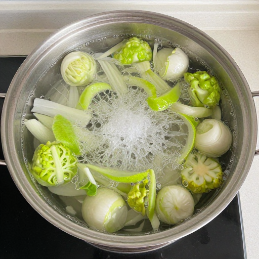

Easy way to loop things in ComfyUI.

## Examples

[example\_workflows](example_workflows/)

Or in manager -> templates -> Spreadsheet2Video

### Long video

[Long video workflow](example_workflows/Spreadsheet2Video_ConcatVideo.json)

### Comparison video

* [Comparison video workflow](example_workflows/Spreadsheet2Video_Comparison.json)

<video src="https://niknah.github.io/Spreadsheet2Video-ComfyUI/mp4/Comparison.mp4" width="1024" controls></video>

### Deforum-like videos example

* [Make zoom / rotate / move parameters with a game controller](https://niknah.github.io/spreadsheet2video-ComfyUI/deforum\_maker.html)
* Copy and paste into a .csv file. [example .csv file](example_workflows/Cooking.csv)
* [workflow](example_workflows/Spreadsheet2Video_deforum.json)

### Non video

* [Audio workflow](example_workflows/Spreadsheet2Video_NonVideo.json)

## Instructions

<video src="https://niknah.github.io/Spreadsheet2Video-ComfyUI/mp4/Spreadsheet2Video_Instructions.mp4" width="1024" controls></video>

## Nodes

| Node | Description |
| -- | -- |
| Spreadsheet2Video | Use a start image or use EmptyImage node if you don't want to make a video |
| Spreadsheet2Video Input Image | Give it a name. Link the columns to your workflow. |
| Spreadsheet2Video Output Image | Put the output image here.  Link the image to the `Spreadsheet2Video Input Image` node if you have no image output.  |
| Spreadsheet2Video Load Text | Optional.  Loads a file, link to spreadsheet when you want to use a .csv file instead of typing in the data.  Can put it into `input` or `input/csv` folders. |
| Other nodes | Ignore them.  Used internally only |

## Warning

The preview might not open the workflow in in the assets list.  You need to download the file and open the file instead.

